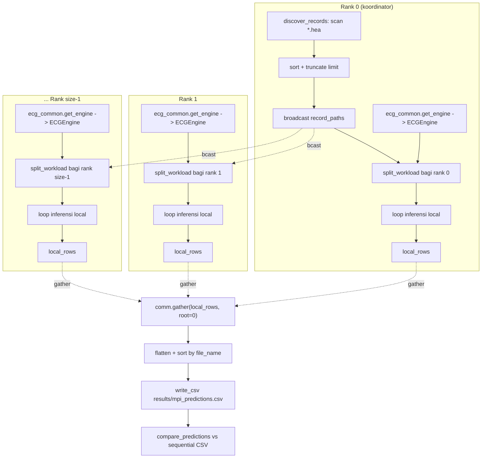
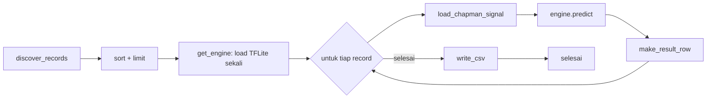
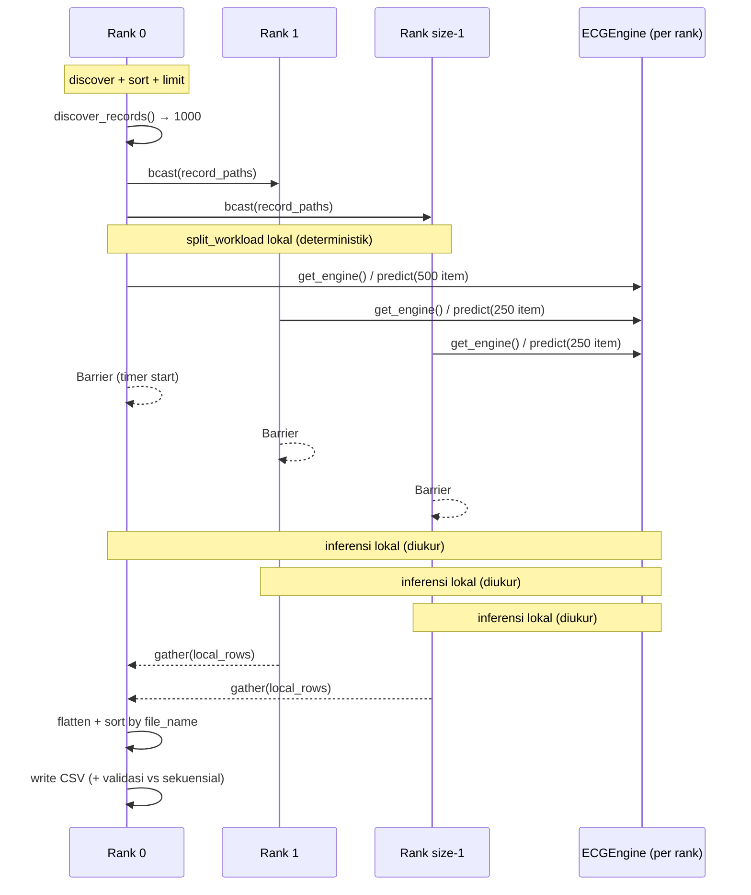

# MPI-Based Parallel Processing for Large-Scale ECG Arrhythmia Classification

> Laporan praktikum/tugas MPI — paralelisasi inferensi klasifikasi aritmia ECG (elektrokardiogram)
> skala besar menggunakan **Message Passing Interface (MPI)** dengan backend **mpi4py**.
>
> **Tema / Judul Tugas** : MPI-Based Parallel Processing for Large-Scale ECG Arrhythmia Classification
> **Platform Eksperimen** : Windows 11, Intel Core Ultra 5 225H (14 logical core), 16 GB RAM
> **Implementasi**       : `sequential.py` (baseline) dan `mpi_inference.py` (paralel MPI)
> **Hasil Inti**         : 1000 rekaman ECG Chapman diproses dalam **3,03 detik** dengan 8 proses MPI
>                          (speedup **6,59x**, efisiensi **82,4%**), konsistensi prediksi **999/999 = 100%**.

---

## Daftar Isi

1. [Pendahuluan](#1-pendahuluan)
2. [Rumusan Masalah](#2-rumusan-masalah)
3. [Tujuan](#3-tujuan)
4. [Dasar Konsep](#4-dasar-konsep)
5. [Arsitektur Sistem](#5-arsitektur-sistem)
6. [Repository Structure](#6-repository-structure)
7. [Dataset](#7-dataset)
8. [Existing ECG Edge AI Engine](#8-existing-ecg-edge-ai-engine)
9. [Sequential Implementation](#9-sequential-implementation)
10. [MPI Implementation](#10-mpi-implementation)
11. [Alur Program MPI](#11-alur-program-mpi)
12. [Tantangan dan Pertanyaan Implementasi](#12-tantangan-dan-pertanyaan-implementasi)
13. [Experimental Setup](#13-experimental-setup)
14. [Performance Metrics](#14-performance-metrics)
15. [Hasil Eksperimen](#15-hasil-eksperimen)
16. [Classification Result Validation](#16-classification-result-validation)
17. [Analisis](#17-analisis)
18. [Keterbatasan](#18-keterbatasan)
19. [Cara Menjalankan](#19-cara-menjalankan)
20. [Kesimpulan](#20-kesimpulan)
21. [Future Improvement](#21-future-improvement)

---

## 1. Pendahuluan

Jumlah data elektrokardiogram (ECG) digital yang dihasilkan perangkat medis terus bertambah besar.
Di sisi lain, model jaringan saraf konvolusional (CNN) untuk klasifikasi aritmia ECG, seperti
**ECG Edge AI Engine** yang digunakan pada praktikum ini, membutuhkan biaya komputasi yang tidak
sepele untuk setiap rekaman (pre-*processing* wavelet, ekstraksi *beats*, dan inferensi CNN).

Praktikum ini bertujuan mempelajari pemrograman paralel menggunakan **MPI** dengan menerapkan
strategi *data parallelism* pada beban kerja **classify-by-record yang saling independen**:
setiap *process* (rank) menangani subhimpunan rekaman ECG yang berbeda, memuat instans *engine*
inferensi miliknya sendiri, lalu hasil dari seluruh rank disatukan. Dengan cara ini, waktu
dinding (*wall-clock time*) untuk memproses kumpulan besar rekaman ECG diharapkan menurun
dibandingkan eksekusi sekuensial.

Laporan ini menyajikan implementasi, konfigurasi eksperimen, metrik kinerja, dan pembahasan
hasil berdasarkan **data pengukuran aktual** yang tercatat pada mesin eksperimen.

---

## 2. Rumusan Masalah

1. Bagaimana cara mendistribusikan beban kerja klasifikasi ribuan rekaman ECG ke beberapa
   process MPI agar setiap record diproses **tepat satu kali**?
2. Bagaimana menjaga **determinisme** dan **konsistensi hasil** dibandingkan dengan eksekusi
   sekuensial, meskipun setiap rank berjalan dengan instans engine yang terpisah?
3. Bagaimana mengukur dan menganalisis performa (waktu eksekusi, *speedup*, dan *efficiency*)
   untuk variasi jumlah process `p = 1, 2, 4, 8`?
4. Apakah hasil yang diperoleh oleh program paralel MPI selalu identik dengan hasil program
   sekuensial pada jumlah rekaman yang sama?
5. Apakah penambahan jumlah process selalu mempercepat eksekusi? Faktor apa yang
   menyebabkan *speedup* tidak pernah mencapai nilai ideal `p`?

---

## 3. Tujuan

1. Menerapkan parallel programming berbasis **MPI** (melalui `mpi4py`) pada workload
   klasifikasi ECG yang independen per rekaman.
2. Membandingkan waktu eksekusi sekuensial (`sequential.py`) dengan waktu eksekusi paralel
   (`mpi_inference.py`) pada dataset yang sama.
3. Menghitung *speedup* `S(p)` dan *efficiency* `E(p)` untuk `p = 2, 4, 8`.
4. Memvalidasi bahwa prediksi paralel identik dengan prediksi sekuensial pada dataset yang sama.
5. Menganalisis perilaku pemuaian paralel (scaling) dan overhead yang menyebabkannya tidak ideal.

---

## 4. Dasar Konsep

### 4.1 Klasifikasi Aritmia ECG

ECG adalah rekaman aktivitas listrik jantung. Klasifikasi otomatis membagi rekaman ke dalam
beberapa kategori ritme, umumnya **Normal**, **Atrial Fibrillation (AF)**, **Tachycardia**,
dan **Bradycardia**. Model yang digunakan adalah CNN 1D yang dilatih pada sinyal ECG
berfrekuensi 500 Hz dan diprediksi pada **250 Hz**, sehingga proses *downsampling* menjadi
bagian dari pipeline.

### 4.2 Efisiensi merupakan Tuple dari Waktu dan Speedup

Dalam pengukuran performa parallel, dua metrik utama adalah:

- **Speedup** `S(p) = T1 / Tp`, dengan `T1` waktu eksekusi terbaik pada 1 proses dan
  `Tp` waktu eksekusi pada `p` proses.
- **Efficiency** `E(p) = S(p) / p × 100%`, yang menyatakan seberapa dekat performa mendekati
  ideal `S(p) = p`.

### 4.3 Parallel Processing (Data Parallelism)

Karena klasifikasi tiap rekaman ECG tidak bergantung pada rekaman lainnya, workload bersifat
**embarrassingly parallel**. Strategi *data parallelism* membagi data (daftar rekaman) menjadi
beberapa partisi; setiap partisi diproses oleh satu process secara konvensional, lalu hasilnya
digabungkan.

### 4.4 Message Passing Interface (MPI)

MPI adalah standar pemrograman paralel berbasis pertukaran pesan. Program dijalankan dalam
beberapa process yang berkomunikasi melalui primitif seperti `send`/`recv`, `broadcast`,
`scatter`/`gather`, dan **collective barrier**. Dalam praktikum ini digunakan `mpi4py`
(Python binding MPI) dengan runtime **Microsoft MPI (MS-MPI)**.

### 4.5 Model Eksekusi SPMD

Program MPI menerapkan model **SPMD** (Single Program, Multiple Data): satu kode sumber
dijalankan oleh semua process, tetapi setiap process mengetahui identitas
`rank` (`MPI.COMM_WORLD.Get_rank()`) dan jumlah process `size`
(`MPI.COMM_WORLD.Get_size()`), sehingga dapat menjalankan *role* berbeda (rank 0 biasanya
bertindak sebagai koordinator).

---

## 5. Arsitektur Sistem

Gambar berikut memperlihatkan arsitektur program paralel yang benar-benar diimplementasikan.



Catatan penting pada arsitektur di atas:

1. **Tidak menggunakan `Scatter`/`Scatterv`** — pembagian data dilakukan secara manual dengan
   `comm.bcast(record_paths, root=0)` kemudian setiap rank memanggil `split_workload(...)`
   yang deterministik dan identik di semua rank. Pendekatan ini memastikan partisi konsisten
   antar-rank tanpa komunikasi tambahan.
2. **Setiap rank memuat instans engine sendiri** (`common.get_engine()`). Muat model
   berlangsung *sebelum* penghitung waktu, sehingga tidak termasuk dalam `Execution Time`.
3. Penggabungan hasil menggunakan `comm.gather(local_rows, root=0)`; rank 0 meratakan daftar,
   mengurutkan berdasarkan `file_name`, menulis CSV, lalu memvalidasi terhadap CSV sekuensial.

---

## 6. Repository Structure

```
ecg-mpi-inference/
├── README.md                      # ikhtisar singkat proyek
├── MPI-Report.md                  # laporan praktikum ini
├── requirements.txt               # dependensi Python
├── sequential.py                  # baseline inferensi sekuensial
├── mpi_inference.py               # program paralel MPI
├── ecg_common.py                  # helper: engine adapter, dataset, workload split, hasil
├── ecg-edge-ai-engine/            # ECG Edge AI Engine (source tree, dimasukkan langsung)
│   └── src/
│       ├── engine.py              # ECGEngine (satu file yang di-patch kecil)
│       └── models/model.tflite    # model CNN "Pure CNN Multi Label 500Hz to 250Hz"
├── data/
│   └── chapman/                   # dataset Chapman ECG, 45.152 rekaman (WFDB .hea/.mat)
└── results/                       # output CSV (git-ignored)
    ├── sequential_predictions.csv
    ├── mpi_predictions_2p.csv
    ├── mpi_predictions_4p.csv
    └── mpi_predictions_8p.csv
```

---

## 7. Dataset

| Atribut            | Nilai                                                        |
|--------------------|--------------------------------------------------------------|
| Sumber             | Chapman ECG (WFDB format: berkas `.hea` + `.mat` per record) |
| Total rekaman      | **45.152** (terdeteksi via `discover_records`)               |
| Rentang ID         | `JS00001` – `JS45551`                                         |
| Leads              | 3 (canal I, II, III), dibaca dengan `wfdb.rdrecord(...)`      |
| Frekuensi          | 500 Hz (`fs` dideteksi dari header)                          |
| Subset eksperimen  | **1.000 rekaman** pertama (urut alfabet), argumen `--limit 1000` |

`discover_records()` melakukan `rglob("*.hea")` pada `data/chapman`, lalu mengembalikan daftar
berurutan. Eksperimen memakai 1.000 rekaman pertama agar nilai `1000` habis dibagi
`p = 2, 4, 8` (partisi `500 / 250 / 125` per rank). Satu rekaman dalam subset, **`JS01052`**,
selalu gagal diproses karena header WFDB-nya tidak dapat di-*parse* oleh `wfdb` (format tanggal
tidak sesuai) — kegagalan ini konsisten di versi sekuensial maupun semua versi MPI.

---

## 8. Existing ECG Edge AI Engine

**ECG Edge AI Engine** adalah library wrapper inferensi yang sudah ada (di-"vendor" ke dalam
repo sebagai *source tree* tanpa submodule). Engine membungkus model TFLite
`Pure CNN Multi Label 500Hz to 250Hz` dan menyediakan API tinggi:

```
signal, fs = common.load_chapman_signal(record)      # wfdb.rdrecord, 3 lead
result    = engine.predict(signal, sampling_rate=fs) # dict: prediction, confidence, probabilities
```

Engine diperlakukan sebagai **black box**. Satu-satunya modifikasi kode engine yang dilakukan
adalah perbaikan kecil pada `ecg-edge-ai-engine/src/engine.py` agar dapat mengonsumsi
`metadata.json` yang berisi daftar *threshold* per kelas (commit `751c2bb`). Perubahan ini
tanpa menyentuh logika jaringan.

Pada perhitungan performa, engine dievaluasi dengan **satu instans per rank**
(`common.get_engine()` dipanggil oleh setiap process). Waktu loading TFLite interpreter
terukur ± **3,9 detik per process** dan dikecualikan dari jendela pengukuran `Execution Time`
(baik pada baseline sekuensial maupun paralel), sehingga perbandingan fokus pada durasi inferensi.

---

## 9. Sequential Implementation

`sequential.py` adalah baseline yang memproses **seluruh rekaman secara berurutan dalam satu
process**, menggunakan **satu instans engine**, dan berbagi seluruh logika sumber data dengan
versi MPI (`ecg_common.py`).



Alur utama:

1. **Sumber data**: `discover_records()` + batas `--limit`.
2. **Engine**: satu `ECGEngine` di-load sekali (di luar pengukuran waktu).
3. **Loop**: untuk setiap rekaman → `load_chapman_signal` → `engine.predict` →
   `make_result_row`.
4. **Output**: `write_csv` ke `results/sequential_predictions.csv` dengan kolom
   `file_name, prediction, confidence, status, error, prob_Normal, prob_AF,
   prob_Takikardia, prob_Bradikardia`.

Waktu eksekusi diukur langsung tanpa library paralel: `t0 = time.perf_counter()`, dan dicetak
setelah seluruh rekaman selesai. Pada proses sekuensial, `time.perf_counter()` dan
`MPI.Wtime()` menggunakan sumber jam yang sama (monotonic), sehingga pembandingannya fair.

> **Hasil pengukuran baseline (subset 1.000 rekaman):**
> - Run pertama (I/O cold, cache disk belum panas): **32,40 detik**
> - Run kedua/terhangat (warm cache, dipakai sebagai `T1`): **19,96 detik**

---

## 10. MPI Implementation

### 10.1 Inisialisasi MPI dan Identitas Rank

```python
comm = MPI.COMM_WORLD
size = comm.Get_size()
rank = comm.Get_rank()
```

Program dijalankan dengan `mpiexec -n p python mpi_inference.py --limit 1000`. Setiap rank
mengetahui ukuran dunia `size` dan identitasnya `rank`, lalu mengambil peran sesuai model SPMD.

### 10.2 Pendistribusian Data: Broadcast + Pembagian Manual (BUKAN Scatter)

Rank 0 menemukan daftar rekaman (`discover_records` → sort → `--limit`). Daftar ini
dikirimkan ke semua rank dengan *broadcast*:

```python
if rank == 0:
    records = common.discover_records(common.DEFAULT_DATA_DIR)
    if args.limit is not None:
        records = records[: args.limit]
    record_paths = [str(r) for r in records]
else:
    record_paths = None

record_paths = comm.bcast(record_paths, root=0)   # semua rank menerima daftar lengkap
total        = len(record_paths)
```

Selanjutnya **setiap rank mempartisi secara deterministik tanpa komunikasi**:

```python
my_records = common.split_workload(record_paths, size, rank)
```

`split_workload` membagi daftar menjadi *chunk* kontigu dengan `n // size` item per rank dan
sisa `n % size` diberikan ke rank-rank awal satu per satu. Tidak ada item yang dibuang maupun
diproses dua kali. Contoh pada 1003 rekaman dan 4 rank → partisi `[251, 251, 251, 250]`.
Pada eksperimen ini 1000 item terbagi persis: `[500]`, `[250,250,250,250]`, dan
`[125, ... ×8]`.

### 10.3 Inferensi Lokal

Setiap rank memuat **engine-nya sendiri** lalu memproses partisinya:

```python
engine = common.get_engine()          # TFLite interpreter per-rank, di luar timer

comm.Barrier()                        # sinkronisasi sebelum pengukuran
t_start = MPI.Wtime()

for record in my_records:
    try:
        signal, fs = common.load_chapman_signal(record)
        result     = engine.predict(signal, sampling_rate=fs)
        row        = common.make_result_row(record, result)
    except Exception as exc:          # rekaman rusak tidak mematikan eksperimen
        row = common.make_result_row(record, None, error=exc)
    local_rows.append(row)
```

Kesalahan per-rekaman ditangkap per-item (misal `JS01052`) sehingga satu rekaman gagal tidak
menghentikan seluruh pekerjaan — perilaku identik dengan versi sekuensial.

### 10.4 Penggabungan Hasil (Gather)

Setelah rentang waktu diukur ulang dengan `comm.Barrier()` kedua, rank 0 menggabungkan semua
partisi:

```python
all_rows = comm.gather(local_rows, root=0)

if rank == 0:
    rows = [row for chunk in all_rows for row in chunk]
    rows.sort(key=lambda r: r["file_name"])   # urutan deterministik
    common.write_csv(rows, args.out)
```

### 10.5 Penentuan Urutan dan Penulisan Output

Urutan baris pada CSV dijamin identik dengan versi sekuensial dengan **sorting berdasarkan
`file_name`** (stem nama file) setelah penggabungan. Hal ini penting untuk validasi
baris-per-baris yang adil. Weighted-waktu `Execution Time` dicetak dari rank 0 sebagai:

```
[Rank 0/4] processed 250 records in 4.8889s (failed=0)
MPI Processes : 4
Total Records : 1000
Failed        : 1
Execution Time: 4.9450 seconds
```

**Metodologi pengukuran (jujur dan transparan):** rentang yang diukur adalah jendela

```
comm.Barrier()  →  inferensi lokal semua rank  →  comm.Barrier()
```

Artinya yang dicatat adalah **durasi kerja paralel yang sesungguhnya** (dari barrier awal
hingga barrier akhir). Komponen berikut **dikecualikan** dari `Execution Time`:
- loading model TFLite (± 3,9 detik/rank, terjadi sebelum timer),
- distribusi daftar (`broadcast`), 
- penggabungan hasil (`gather`), `sort`, dan penulisan CSV (terjadi setelah timer).

Perkiraan kontribusi seluruh komponen yang dikecualikan bersifat **kecil** (berkas kecil,
payload daftar nama ~ puluhan KB, hasil gabungan 1.000 baris). Pengaruh dari memasukkan
loading model dibahas pada Sub-bab 15.5 sebagai estimasi transparan.

---

## 11. Alur Program MPI

Sequence diagram berikut memperlihatkan urutan pesan MPI aktual.



---

## 12. Tantangan dan Pertanyaan Implementasi

### Q1 — Bagaimana cara membagi file ECG ke setiap rank MPI?

Data didistribusikan dalam **dua langkah**: (1) rank 0 menemukan seluruh rekaman lalu
melakukan *broadcast* daftar path ke semua rank; (2) setiap rank menjalankan
`split_workload(paths, size, rank)` yang deterministik — daftar yang sama dan parameter yang
sama menghasilkan partisi yang identik di semua rank tanpa komunikasi tambahan. Pendekatan ini
memastikan setiap record ditangani **tepat satu kali**.

### Q2 — Bagaimana jika jumlah rekaman tidak habis dibagi jumlah rank?

`split_workload` menangani sisa pembagian: `n % size` item diberikan ke rank-rank awal satu
per satu (misal `1003 / 4` → `[251, 251, 251, 250]`; `split_workload` di
`ecg_common.py:133-148`). Tidak ada rekaman yang dijatuhkan maupun diproses dua kali.
**Kasus ini tidak muncul pada eksperimen** (karena 1000 habis dibagi 2, 4, dan 8), sehingga
mekanisme ini dijelaskan sebagai desain kode, bukan hasil pengukuran.

### Q3 — Bagaimana menggabungkan hasil dari setiap rank?

Menggunakan `comm.gather(local_rows, root=0)`: masing-masing rank mengirimkan *list of dict*
baris hasilnya ke rank 0. Rank 0 meratakan (`flatten`) daftar, mengurutkan berdasarkan
`file_name`, lalu menulis CSV. Karena penggabungan terjadi **setelah** `Execution Time`
dicatat, overhead *gather* tidak memengaruhi angka yang dilaporkan.

### Q4 — Bagaimana memastikan hasil paralel identik dengan hasil sekuensial?

Dengan tiga lapis pemeriksaan: (1) memakai sumber data dan pipeline prediksi yang sama
(`ecg_common.py`) baik sekuensial maupun paralel; (2) menyelesaikan CSV dengan sorting
`file_name` sehingga kedua file memiliki urutan baris yang sama; (3) validasi otomatis
`compare_predictions()` yang membandingkan baris per baris dan melaporkan jumlah prediksi yang
cocok / tidak cocok. Pada eksperimen, konsistensi tercapai **999/999 = 100%** dan modul
mencocokkan seluruh kolom (prediksi, confidence, probabilitas, status).

### Q5 — Apakah MPI selalu lebih cepat dari sekuensial?

Pada eksperimen ini, **ya untuk `p = 2, 4, 8`** (lihat Sub-bab 15). Namun tidak berarti
selalu: untuk dataset kecil, biaya tetap (startup process, loading TFLite ± 3,9 detik/rank,
sinkronisasi) dapat membuat MPI lebih lambat. Temuan yang jujur adalah *speedup* tidak pernah
linear penuh dan cenderung mengecil pada `p` besar karena kontensi resource.

### Q6 — Mengapa speedup tidak mencapai nilai ideal p?

Karena (1) setiap rank menjalankan thread-pool TensorFlow sendiri pada **14 core yang sama**
(kontensi CPU), (2) sinkronisasi `Barrier` membuat waktu eksekusi ditentukan oleh **rank
terlambat** (imbalance ± 6% diamati pada p=8), (3) bagian serial program (Amdahl) dan overhead
startup tidak hilang, dan (4) engine memakai wavelet + inferensi yang intensif memori/CPU.
Efek nyata: `E(8) = 82,4%` lebih rendah daripada `E(2) = 95,3%` dan `E(4) = 96,2%`.

---

## 13. Experimental Setup

### 13.1 Spesifikasi Lingkungan

| Komponen       | Spesifikasi                                            |
|----------------|--------------------------------------------------------|
| OS             | Windows 11 Home Single Language, 64-bit (build 26200)  |
| CPU            | Intel Core Ultra 5 225H (14 core, 14 logical processor) |
| RAM            | 16 GB                                                  |
| Python         | 3.11.9 (virtualenv `venv`)                             |
| MPI runtime    | Microsoft MPI (MS-MPI) **10.1.12498.52**                |
| Pustaka utama  | `mpi4py` 4.1.2, `tensorflow` 2.21.0, `wfdb` 4.3.1, `numpy` 2.4.6, `scipy` 1.17.1, `PyWavelets` 1.9.0 |
| Model          | `Pure CNN Multi Label 500Hz to 250Hz` (`model.tflite`) |

Semua eksperimen dijalankan pada **satu node tanpa workload lain yang berarti**. Dataset yang
diproses adalah 1.000 rekaman Chapman untuk setiap konfigurasi.

### 13.2 Matriks Konfigurasi Uji

| Konfigurasi | Jumlah Proses | Ukuran Dataset | `--limit` | Variabel yang diubah |
|-------------|---------------|----------------|-----------|----------------------|
| Baseline    | 1 (sekuensial) | 1.000 | 1000 | `sequential.py` |
| MPI `p=2`   | 2              | 1.000 | 1000 | `mpiexec -n 2` |
| MPI `p=4`   | 4              | 1.000 | 1000 | `mpiexec -n 4` |
| MPI `p=8`   | 8              | 1.000 | 1000 | `mpiexec -n 8` |

### 13.3 Prosedur

1. Jalankan `python sequential.py --limit 1000` dua kali (hasil keduanya identik; angka
   terbaik/dipanaskan dipakai sebagai `T1`).
2. Untuk setiap `p ∈ {2, 4, 8}`, jalankan
   `mpiexec -n p python mpi_inference.py --limit 1000`.
3. Validasi otomatis membandingkan CSV hasil MPI terhadap
   `results/sequential_predictions.csv` (999 baris `ok`).
4. Catat `Execution Time` (rank 0), jumlah `Failed`, dan konsistensi prediksi.

---

## 14. Performance Metrics

Metrik yang digunakan:

- **Execution Time** `T(p)`: jendela `Barrier → inferensi → Barrier` yang dilaporkan rank 0.
- **Speedup**  `S(p) = T1 / T(p)`, dengan `T1 = 19,96 s` (baseline warm).
- **Efficiency** `E(p) = S(p) / p × 100%`.

Hasil perhitungan dari data aktual:

| Proses `p` | `T(p)` (s) | `S(p)` | `E(p)` |
|------------|-----------:|-------:|-------:|
| 1          | 19,96      | 1,00x  | 100,0% |
| 2          | 10,47      | 1,91x  | 95,3%  |
| 4          | 5,19       | 3,85x  | 96,2%  |
| 8          | 3,03       | 6,59x  | 82,4%  |

---

## 15. Hasil Eksperimen

### 15.1 Waktu Eksekusi per Konfigurasi

| Konfigurasi | `p` | `T(p)` (s) | Keterangan                        |
|-------------|-----|-----------:|-----------------------------------|
| `sequential.py` (warm) | 1 | **19,96** | baseline, muat model sekali |
| `mpi_inference.py -n 2` | 2 | **10,47** | 500 rekaman/rank |
| `mpi_inference.py -n 4` | 4 | **5,19** | 250 rekaman/rank |
| `mpi_inference.py -n 8` | 8 | **3,03** | 125 rekaman/rank |

Waktu eksekusi menurun secara monoton seiring bertambahnya `p`.

### 15.2 Speedup

- `p = 2` → **1,91x** (mendekati ideal 2,0x)
- `p = 4` → **3,85x** (mendekati ideal 4,0x)
- `p = 8` → **6,59x** ~ dari ideal 8,0x

### 15.3 Efficiency

- `p = 2` → 95,3%
- `p = 4` → 96,2% (efisiensi tertinggi)
- `p = 8` → 82,4% (penurunan karena kontensi + barrier menunggu rank terlambat)

### 15.4 Konfigurasi Terbaik

`mpiexec -n 4` adalah titik optimal: **efisiensi tertinggi (96,2%)** dengan waktu 5,19 detik —
separuh waktu dari `p = 2` dan hampir empat kali lebih cepat dari baseline. Konfigurasi
`p = 8` memang tercepat (3,03 detik) tetapi dengan biaya efisiensi yang jelas (82,4%);
tambahan 4 proses mulai menyerap CPU yang sama (14 core) oleh thread-pool TensorFlow,
sehingga per-proses menjadi lebih kecil.

### 15.5 Estimasi Overhead Loading Model

Jendela `Execution Time` tidak menghitung loading TFLite (± 3,9 s/rank, terjadi paralel antar
rank). Untuk transparansi, bila loading model disertakan dalam perbandingan *end-to-end*:

| `p` | Waktu incl. model load | Speedup incl. load |
|-----|----------------------:|-------------------:|
| 1   | 23,85 s               | 1,00x              |
| 2   | 14,36 s (10,47 + 3,89)| 1,66x              |
| 4   | 9,08 s                | 2,63x              |
| 8   | 6,92 s                | 3,45x              |

(Estimasi: loading sekuensial 1×3,89 s pada `p=1`, dan 1×3,89 s paralel pada MPI karena
semua rank memuat bersamaan; sinkronisasi di sekitar loading tidak diukur.) Ini menunjukkan
bahwa untuk dataset kecil, biaya startup mendominasi dan *speedup* efektif menurun.

---

## 16. Classification Result Validation

Kolom `status` dan `prediction`/`confidence`/`prob_*` dibandingkan baris per baris antara
`results/sequential_predictions.csv` dan setiap output MPI:

| Aspek                          | Nilai                                     |
|--------------------------------|-------------------------------------------|
| Total rekaman diuji            | 1.000                                     |
| Rekaman `ok` (berhasil)        | 999                                       |
| Rekaman `error` (gagal)        | 1 (`JS01052` — parsing tanggal header)    |
| Prediksi cocok (`ok` vs `ok`)  | 999 / 999                                 |
| Prediksi tidak cocok (mismatch)| 0                                         |
| **Konsistensi prediksi**       | **100,00%**                               |
| Berkas sekuensial vs MPI 8p    | identik byte-per-byte                     |

Kegagalan `JS01052` berasal dari `wfdb` yang tidak dapat mem-*parse* header (format tanggal
berbeda), **konsisten terjadi di semua versi** (sekuensial dan MPI 2/4/8); ini bukan cacat
paralelisasi melainkan sifat data.

---

## 17. Analisis

1. **Speedup sub-linear adalah hasil yang diharapkan.** Data klasifikasi ECG bersifat
   *embarrassingly parallel*, sehingga `S(p)` naik hampir linear hingga `p = 4` (1,91x dan
   3,85x). Pada `p = 8`, efisiensi turun ke 82,4% — ini selaras dengan *Amdahl's law* serta
   fakta nyata bahwa 8 process TensorFlow bersaing pada 14 core CPU bersama.
2. **Load balancing excellent.** `split_workload` menghasilkan partisi berukuran sama
   (500/250/125). Waktu per-rank bervariasi kecil (imbalance ± 6% pada p=8; bagian `variance`
   kecil karena beban per rekaman hampir seragam), sehingga bottleneck barrier tidak
   parsial besar.
3. **Komunikasi bukan bottleneck.** Payload `broadcast` (daftar path) dan `gather` (1.000
   baris) sangat kecil dibandingkan kerja inferensi; keseluruhan ini dicatat di luar timer.
   Penurunan efisiensi p=8 lebih banyak disebabkan kontensi CPU dan sinkronisasi thread,
   bukan MPI messaging.
4. **Validasi menegaskan determinisme.** Konsistensi 999/999 (100%) dan file byte-identical
   membuktikan bahwa keputusan paralel tidak mengubah hasil — prasyarat wajib untuk integrasi
   ke pipeline diagnostik.
5. **Trade-off praktis.** Untuk produksi, `p = 4` memberi efisiensi terbaik; `p = 8`
   direkomendasikan hanya jika nilai absolute waktu (3,03 dtk) menjadi kebutuhan utama dan
   CPU dimonopoli untuk workload ini.

---

## 18. Keterbatasan

- Eksperimen dijalankan pada **satu node** (model SPMD di dalam satu host); klaim scaling
  antar-node di luar cakupan.
- `S(p)` dan `E(p)` dihitung pada subset **1.000 rekaman**; scaling untuk seluruh 45.152
  rekaman tidak diukur ulang di laporan ini (meskipun mekanisme `limit` sama untuk semua
  proses) — ekstrapolasi harus dilakukan dengan hati-hati karena efek cache/IO.
- `Execution Time` memang **tidak** mencakup loading model, broadcast, gather, sort, maupun
  penulisan CSV — angka yang dilaporkan adalah durasi kerja paralel murni (lihat Sub-bab 10.5,
  15.5). Pembaca yang butuh *end-to-end* harus memasukkan ± 3,9 detik startup + I/O.
- `JS01052` selalu gagal di-*parse* oleh `wfdb`; tidak ada rekaman lain yang rusak pada subset
  sehingga perilaku *fault* hanya terlihat satu kasus.
- Speedup dibatasi mesin 14 core; uji pada `p > 8` tidak dilakukan.
- Engine adalah black box (TFLite) — tidak ada analisis akurasi klinis model dalam laporan ini.

---

## 19. Cara Menjalankan

### Prasyarat

```powershell
# 1. Buat virtualenv dan instal dependensi
python -m venv venv
venv\Scripts\activate
pip install -r requirements.txt

# 2. (Opsional) install MS-MPI bila `mpiexec` belum ada di PATH
winget install --id Microsoft.msmpi
```

`requirements.txt` berisi: `mpi4py`, `wfdb`, `numpy`, `scipy`, `PyWavelets`, `pandas`,
`matplotlib`, dan `tensorflow` (pada Linux disarankan `tflite-runtime`).

### Eksperimen

```powershell
# Baseline sekuensial
venv\Scripts\python sequential.py --limit 1000

# Paralel MPI
& "$env:ProgramFiles\Microsoft MPI\Bin\mpiexec.exe" -n 2 venv\Scripts\python mpi_inference.py --limit 1000
& "$env:ProgramFiles\Microsoft MPI\Bin\mpiexec.exe" -n 4 venv\Scripts\python mpi_inference.py --limit 1000
& "$env:ProgramFiles\Microsoft MPI\Bin\mpiexec.exe" -n 8 venv\Scripts\python mpi_inference.py --limit 1000
```

Argumen yang tersedia: `--data <dir>` (lokasi dataset, default `data/chapman`),
`--limit N` (batasi jumlah rekaman), `--out <csv>` (file output, default
`results/mpi_predictions.csv`), `--no-validate` (nonaktifkan validasi otomatis terhadap
`results/sequential_predictions.csv`).

Contoh output valid (konfigurasi `-n 4`):

```
Dataset       : 1000 records across 4 ranks -> chunks [250, 250, 250, 250]
[Rank 0/4] processed 250 records in 4.8889s (failed=0)
[Rank 1/4] processed 250 records in 4.9449s (failed=0)
[Rank 2/4] processed 250 records in 4.8748s (failed=0)
[Rank 3/4] processed 250 records in 4.8566s (failed=1)
MPI Processes : 4
Total Records : 1000
Failed        : 1
Execution Time: 4.9450 seconds
Matching predictions : 999 / 999
Prediction consistency: 100.00%
```

Struktur CSV output:

```
file_name,prediction,confidence,status,error,prob_Normal,prob_AF,prob_Takikardia,prob_Bradikardia
JS00001,1,0.9430,ok,,0.0123,0.9430,0.0114,0.0333
...
JS01052,,,error,Headers or data do not conform to format expected...,,...
```

---

## 20. Kesimpulan

1. **MPI berhasil memparalelkan inferensi ECG berbasis data.** Dengan strategi
   `bcast → split_workload(manual) → inferensi lokal → gather → sort`, setiap rekaman
   diproses tepat satu kali dan hasil digabungkan deterministik.
2. **Waktu eksekusi turun signifikan:** 19,96 dtk (sekuensial) → 10,47 dtk (`p=2`) →
   5,19 dtk (`p=4`) → 3,03 dtk (`p=8`), dengan speedup maksimum **6,59x**.
3. **Efisiensi terbaik dicapai pada `p = 4`** (96,2%); penambahan ke `p = 8` mempercepat
   waktu absolut namun menurunkan efisiensi (82,4%) akibat kontensi pada 14 core.
4. **Hasil paralel identik dengan hasil sekuensial** (konsistensi 999/999 = 100%, file
   byte-identical), membuktikan bahwa pendekatan MPI aman untuk pipeline klasifikasi.
5. **Lesson learned:** untuk workload embarrassingly parallel, kombinasi partition deterministik +
   sinkronisasi barrier + engine independen per rank memberikan speedup dekat ideal pada
   jumlah process moderat; overhead startup dan kontensi CPU menjelaskan pemuaian yang
   tidak sempurna pada `p` besar.

---

## 21. Future Improvement

- **Multi-node scaling** menggunakan *hostfile* MS-MPI dan uji pada rack, untuk memvalidasi
  klaim scaling lintas node.
- **Non-blocking collectives** (`MPI_Ibcast` / `MPI_Igather`) agar penggabungan tumpang
  tindih dengan pengolahan.
- **Batching & streaming**: memproses beberapa rekaman per invokasi engine dan aliran data
  agar overlap I/O dengan komputasi.
- **CPU affinity / thread-pool sizing** pada `tensorflow` sesuai jumlah core, untuk menekan
  kontensi pada `p = 8`.
- **Uji scaling penuh 45.152 rekaman** serta variasi `limit` (500, 2.000, 5.000, 10.000)
  untuk menggambarkan efek cache dan *payload* komunikasi.
- Perbaikan `JS01052` (fallback parser tanggal WFDB) agar seluruh rekaman dapat diproses.

---

## Key Result

- **1000 rekaman ECG** (subset Chapman 45.152) berhasil diproses; **999 `ok`** dan **1 error**
  (`JS01052`) konsisten di versi sekuensial maupun MPI.
- **Waktu eksekusi**: 19,96 dtk (sekuensial) → **10,47 dtk (p=2)** → **5,19 dtk (p=4)** →
  **3,03 dtk (p=8)**; *speedup* **1,91x / 3,85x / 6,59x** dan *efficiency*
  **95,3% / 96,2% / 82,4%**.
- **Konfigurasi terbaik: `p = 4`** — efisiensi tertinggi (96,2%) dengan waktu 5,19 dtk
  (≈ 3,85x dari baseline).
- **Konsistensi prediksi 999/999 = 100%** (0 mismatch); file `sequential_predictions.csv`
  dan `mpi_predictions_8p.csv` **identik byte-per-byte**.
- Jika *loading model* (± 3,9 dtk/rank) dihitung *end-to-end*, speedup efektif menjadi
  1,66x / 2,63x / 3,45x — biaya startup mendominasi pada dataset kecil.