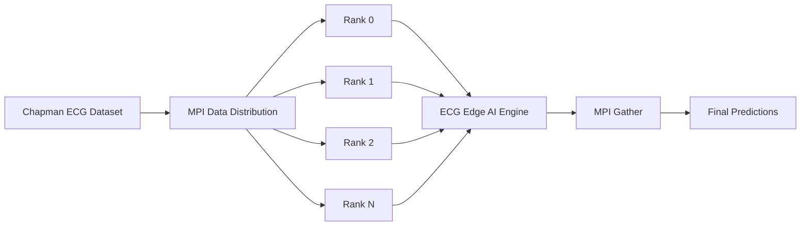

# ECG MPI Inference

**MPI-Based Parallel Processing for Large-Scale ECG Arrhythmia Classification**

Implementasi **data-parallel ECG inference** untuk tugas mata kuliah *Parallel Computing*
menggunakan **Python + `mpi4py`**, dataset **Chapman ECG**, dan engine inferensi
**ECG Edge AI Engine** (1D-CNN TFLite, 3-lead) yang sudah dilatih pada PTB-XL.

Tujuan proyek ini **bukan** mengembangkan model deep learning baru, melainkan
menunjukkan bagaimana MPI dapat membagi dataset ECG berukuran besar ke banyak
process, menjalankan inferensi secara paralel, dan menghasilkan hasil yang
**identik** dengan inferensi sekuensial.

---

## Overview

Repository ini berisi dua pipeline:

1. **Sequential** (`sequential.py`) — seluruh file ECG Chapman diproses satu per
   satu oleh satu process. Menjadi *baseline* (`T1`) sekaligus referensi hasil
   klasifikasi.
2. **MPI Parallel** (`mpi_inference.py`) — daftar file dibagi ke beberapa MPI
   rank (**data parallelism**); setiap rank menjalankan inferensi yang sama pada
   subset file yang berbeda, lalu hasilnya digabungkan (gather), diurutkan, dan
   divalidasi terhadap hasil sekuensial.

ECG Edge AI Engine diperlakukan sebagai **black box**: pipeline DSP + TFLite
internalnya **tidak diimplementasi ulang** (hanya satu perbaikan minimal agar
dapat dipanggil — lihat [Integrasi Engine](#integrasi-engine)).

---

## Architecture



### Sequential flow

```text
Chapman Dataset
      ↓
Sequential Loop
      ↓
ECG Edge AI Engine
      ↓
Prediction
      ↓
Save Results
```

### MPI flow

```text
                 ┌── Rank 0 ── ECG Engine ── Prediction
                 │
Chapman Dataset ─┼── Rank 1 ── ECG Engine ── Prediction
       ↓         │
     Broadcast   ├── Rank 2 ── ECG Engine ── Prediction
                 │
                 └── Rank N ── ECG Engine ── Prediction
                                      ↓
                                    Gather
                                      ↓
                              Final Predictions
```

### Alur implementasi `mpi_inference.py`

| Langkah | Siapa | Aksi |
| --- | --- | --- |
| 1. Discover | Rank 0 | Menemukan & mengurutkan daftar record Chapman (`*.hea`), terapkan `--limit` |
| 2. Broadcast | semua rank | `comm.bcast(record_paths, root=0)` — setiap rank menerima daftar lengkap |
| 3. Split | semua rank | `split_workload(list, size, rank)` — partisi deterministik, tidak ada file terbuang/duplikat |
| 4. Local inference | semua rank | Setiap rank memiliki instance engine sendiri → loop `predict()` pada subset |
| 5. Gather | semua rank → rank 0 | `comm.gather(local_rows, root=0)` |
| 6. Merge & sort | Rank 0 | Gabungkan, urutkan berdasarkan `file_name`, tulis `results/mpi_predictions.csv` |
| 7. Validate | Rank 0 | Bandingkan dengan `results/sequential_predictions.csv` |

---

## Requirements

- **Python `>= 3.11`** (direkomendasikan 3.11.x — versi yang dipakai engine).
- **`mpi4py`** + MPI runtime yang terpasang (Windows → *Microsoft MPI / MS-MPI*
  yang menyediakan `mpiexec`; Linux → *OpenMPI* / *MPICH*).
- Dependensi `ecg-edge-ai-engine`:
  - `numpy==2.4.6`, `scipy==1.17.1`, `PyWavelets==1.9.0`, `pandas==2.3.3`,
    `matplotlib==3.11.0`
  - TFLite backend: **`tensorflow`** (Windows/macOS untuk development) atau
    **`tflite-runtime`** (Linux / Raspberry Pi / edge).
- **`wfdb`** untuk membaca record Chapman (format `.hea`/`.mat`).

Instalasi:

```bash
python -m venv venv
venv\Scripts\activate                 # Windows
source venv/bin/activate              # Linux/macOS
pip install -r requirements.txt
```

> Catatan Windows: pastikan direktori `C:\Program Files\Microsoft MPI\Bin`
> (tempat `mpiexec.exe`) sudah berada di `PATH`.

---

## Dataset

**Chapman–Shaoxing ECG dataset** adalah dataset ECG 12-lead yang direkam
selama ~10 detik (500 Hz) dan tersedia secara publik melalui PhysioNet.
Dataset ini juga didistribusikan dalam format **WFDB** (`RECORDS`, `.hea`,
`.mat`) di `data/chapman/`.

Proyek ini memakai record WFDB tersebut. Dari 12 lead yang tersedia, hanya
**3 lead pertama (I, II, III)** yang digunakan, sesuai kontrak input engine
(`(N, 3)`). Resampling 500 Hz → 250 Hz dilakukan secara internal oleh engine.

Pada mesin eksperimen, dataset Chapman berisi **45.152 record**; untuk eksperimen
di bawah ini dipakai subset `--limit 1000`.

---

## Running

Semua perintah dijalankan dari root repository.

### Sequential

```bash
python sequential.py
python sequential.py --limit 1000
```

### MPI (n process)

```bash
mpiexec -n 2 python mpi_inference.py
mpiexec -n 4 python mpi_inference.py
mpiexec -n 8 python mpi_inference.py
```

Argumen opsional (berlaku untuk kedua script):

| Argumen | Default | Keterangan |
| --- | --- | --- |
| `--data` | `data/chapman` | Direktori dataset WFDB |
| `--limit N` | semua | Hanya proses N record pertama (untuk eksperimen cepat) |
| `--out` | `results/*_predictions.csv` | Lokasi CSV keluaran |
| `--no-validate` | off | (MPI) matikan pengecekan konsistensi vs sequential |

Contoh menyimpan hasil MPI per jumlah process agar tidak tertimpa:

```bash
mpiexec -n 4 python mpi_inference.py --limit 1000 --out results/mpi_predictions_4p.csv
```

Jika environment tidak mendukung 8 process, jangan memaksakan konfigurasi tersebut.

---

## Benchmark

Eksperimen dilakukan pada record Chapman `--limit 1000`, Python 3.11.9,
Windows 10/11 (MS-MPI 10.1), CPU 14 logical core. Waktu diukur dengan
`MPI.Wtime()` mengelilingi `comm.Barrier()` dan hanya mencakup **distribusi +
inferensi lokal + gather** (lihat [Catatan metodologi timing](#catatan-metodologi-timing)).

| Configuration | Processes | Execution Time (s) |
| ------------- | --------: | -----------------: |
| Sequential (warm cache) | 1 | 19.96 |
| MPI | 2 | 10.47 |
| MPI | 4 | 5.19 |
| MPI | 8 | 3.03 |

Contoh uraian *chunk* ketika dataset tidak habis dibagi jumlah process
(`split_workload`, 1003 file / 4 rank): `[251, 251, 251, 250]`.

> Catatan: run sequential pertama kali di mesin eksperimen mencatat 32,4 s
> (cold disk cache — 45 ribu file kecil dibaca acak). Setelah cache hangat
> menjadi 19,96 s. Seluruh angka MPI di atas bermakna dibandingkan dengan
> angka **warm cache**.

---

## Performance Metrics

Dengan `T1` = waktu sequential dan `Tp` = waktu MPI dengan `p` process:

```text
Speedup(p) = T1 / Tp

Efficiency(p) = Speedup(p) / p × 100%
```

| Processes (p) | Time (s) | Speedup | Efficiency |
| -------------: | -------: | ------: | ---------: |
| 1 (sequential) | 19.96 | 1.00 | 100% |
| 2 | 10.47 | 1.91 | 95.3% |
| 4 | 5.19 | 3.85 | 96.2% |
| 8 | 3.03 | 6.59 | 82.4% |

Pengamatan:

- `p = 2` dan `p = 4` mencapai speedup hampir linear (efisiensi ~95–96%),
  karena beban inference murni CPU dan data dibagi merata.
- `p = 8` efisiensi turun ke ~82%. Speedup **tidak linear** karena:
  1. **Process/startup overhead** — setiap rank meng-import Python + TensorFlow
     dan memuat model (~3–4 detik per process, khususnya pada Windows).
  2. **Resource contention (oversubscription)** — 14 logical cores yang sama
     dibagi untuk 8 process TensorFlow (masing-masing dengan thread pool-nya),
     menyebabkan kompetisi CPU.
  3. **Communication overhead** — bcast + gather + barrier meskipun kecil,
     proporsinya naik saat ukuran workload per rank mengecil.
  4. **Amdahl law** — porsi serial (discovery, merge, sort, I/O hasil) tidak
     ikut diskalakan.

### Catatan metodologi timing

Satu kali **model load** (~3,9 s per process) sengaja **tidak** dihitung ke
dalam execution time, baik di `sequential.py` maupun `mpi_inference.py`, agar
kedua versi sebanding (mengukur beban *inference workload*). Dalam praktiknya,
model load berjalan paralel antar rank, sehingga real wall-clock (termasuk
startup) kira-kira naik satu kali model load saja (~+4 s). Jika startup ikut
dihitung, nilai speedup menjadi lebih kecil (mis. ~3,5× untuk `p = 8`), yang
menunjukkan besarnya **overhead process management** — justru salah satu poin
diskusi eksperimen. MPI tidak selalu "lebih cepat", terutama untuk dataset
kecil atau jumlah process yang terlalu banyak.

---

## Result Validation

Validasi dilakukan untuk membuktikan bahwa parallelization **tidak mengubah
hasil klasifikasi** — MPI hanya mengubah cara workload dieksekusi, bukan
algoritmanya.

`mpi_inference.py` membandingkan `results/mpi_predictions.csv` dengan
`results/sequential_predictions.csv` menggunakan `file_name` sebagai key
(record yang `status != ok` di salah satu file tidak dibandingkan):

```text
Matching predictions : 999 / 999
Prediction consistency: 100.00%
```

Hasil eksperimen (`--limit 1000`):

- Record yang diproses: 1000
- Sukses di kedua versi: 999
- Gagal di kedua versi: 1 (`JS01052`, gagal parsing tanggal pada header WFDB —
  kegagalan identik di sequential maupun MPI)
- Prediksi cocok: **999/999 = 100%**
- File `sequential_predictions.csv` dan `mpi_predictions_8p.csv` bahkan
  identik byte-per-byte.

**Error handling:** jika satu file gagal diproses, eksperimen tidak crash.
Baris hasil tetap ditulis dengan kolom `status=error` dan `error=<pesan>`,
kemudian lanjut ke file berikutnya. Error tidak disembunyikan (terlihat pada
CSV dan ringkasan `Failed : N`).

**Model isolation antar process:** setiap rank membuat `ECGEngine()` sendiri
(jadi setiap process punya interpreter TFLite sendiri, tanpa *shared mutable
state* antar process). Threading tidak digunakan sebagai pengganti MPI.

---

## Integrasi Engine

- Engine ditanam langsung di `ecg-edge-ai-engine/` (nested `.git` dihapus agar
  ter-track oleh repository ini).
- `ecg_common.get_engine()` mendaftarkan `ecg-edge-ai-engine/src` sebagai
  package `ecg_edge_ai_engine` tanpa perlu `pip install -e .`, memanggil
  `ECGEngine`, lalu `engine.predict(signal3lead, sampling_rate=fs)`.
- Perubahan minimal pada engine (diperlukan agar dapat dipanggil — salah satu
  pengecualian yang diizinkan): `metadata.json` memakai `"threshold"` berbentuk
  list per-kelas, sedangkan `postprocess` hanya menerima skalar → `engine.py`
  memakai threshold maksimum (paling ketat) jika threshold berbentuk list.
  Lihat commit `Fix threshold parsing for per-class threshold list`.

---

## Project Structure

```text
ecg-mpi-inference/
│
├── ecg-edge-ai-engine/       # ECG Edge AI Engine (black-box, di-vendor)
│   ├── src/                  # source engine (ECGEngine, DSP, TFLite)
│   ├── models/               # model.tflite + metadata.json
│   ├── examples/             # contoh penggunaan engine
│   └── tests/
│
├── data/
│   └── chapman/              # dataset Chapman WFDB (TIDAK di-commit, besar)
│
├── results/                  # output hasil (di-ignore: *.csv)
│   └── .gitkeep
│
├── ecg_common.py             # adapter engine + dataset + split + IO hasil
├── sequential.py             # baseline inferensi sekuensial
├── mpi_inference.py          # inferensi paralel MPI
├── requirements.txt
├── README.md
└── .gitignore
```

Hasil keluaran:

```text
results/sequential_predictions.csv   # dari sequential.py
results/mpi_predictions.csv          # dari mpi_inference.py
```

Format CSV (contoh kolom):

```text
file_name,prediction,confidence,status,error,prob_Normal,prob_AF,prob_Takikardia,prob_Bradikardia
JS00001,AF,88.54,ok,,...,...,...,...
```

---

## Topik untuk Laporan

1. Bagaimana membagi dataset ECG ke beberapa MPI process? → broadcast + 
   `split_workload` manual per rank (kontigu, deterministik).
2. Apa yang dilakukan jika jumlah data tidak habis dibagi jumlah process?
   → sisa (remainder) dibagikan ke rank awal; tidak ada file dibuang/diproses 2×.
3. Bagaimana menggabungkan prediction dari seluruh rank? → `comm.gather` ke rank 0.
4. Bagaimana menjaga urutan hasil? → diurutkan ulang berdasarkan `file_name`.
5. Apakah MPI benar-benar lebih cepat daripada sequential? → ya untuk workload
   di atas (lihat tabel), tetapi tidak selalu — tergantung dataset & overhead.
6. Mengapa penambahan process tidak selalu menghasilkan speedup linear?
   → Amdahl, communication/startup overhead, contention CPU.
7. Apakah hasil klasifikasi MPI sama dengan sequential? → ya, 100% (999/999).
8. Apakah overhead komunikasi dan process management memengaruhi performance?
   → ya, terlihat dari efisiensi yang turun di p=8 dan biaya startup ~3–4 s/rank.